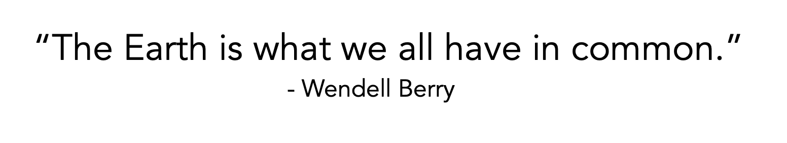

<p>
  
  
  
</p>

<p>
  
  
  
</p>


# Table of contents

<!-- TOC -->
- [Table of contents](#table-of-contents)
- [About](#about)
- [Installation](#installation)
  - [Git](#git)
  - [Docker](#docker)
- [Usage](#usage)
- [Contributing](#contributing)
- [Help](#help)
- [Credits](#credits)

# About

***Leco*** is a THE web app for environnement and stuff 🌳 created by **ESIEE Paris** students, [Itokiana RAFIDINARIVO](https://www.linkedin.com/in/itokiana-rafidinarivo/) and [Romain FONTA](https://www.linkedin.com/in/fonta-romain-84130617a/).

This web app is the end of «*Data Engineering*» course project which implements: 
- Web Scraping with ***Python***, ***Scrapy*** package
- Web Developpement with ***Python***, ***Flask*** package
- Text sentiment analysis with ***Python***, ***TextBlob*** package
- *NoSQl* Storage with ***MongoDB***
- App Containerization with ***Docker***

# Installation

## Git 

You can download the project by pressing the ***Code/Download ZIP*** button on GitHub or else you can type the following command in your terminal if you have Git of course.

```
$ git clone https://github.com/rafidini/dsia-4201c.git
```

## Docker

> **Docker**
:
*Docker is a set of platform as a service products that use OS-level virtualization to deliver software in packages called containers. Containers are isolated from one another and bundle their own software, libraries and configuration files; they can communicate with each other through well-defined channels. - **Wikipedia***

You can download the desktop software by taking a look at this [link](https://www.docker.com/get-started).

In order to use the app you will have to install both ***Docker*** and ***Docker Compose***.

# Usage

Make sure you have downloaded ***Docker*** and ***Docker Compose*** before beginning.

1. Navigate your shell into the project directory
2. Launch the following command

```
$ docker-compose up
```
3. Check the output
```
...
web_1      | > X items were saved in the database.
web_1      | > 0 items were not saved in the database.
web_1      |  * Serving Flask app "web" (lazy loading)
web_1      |  * Environment: production
web_1      |    WARNING: This is a development server. Do not use it in a production deployment.
web_1      |    Use a production WSGI server instead.
web_1      |  * Debug mode: off
web_1      |  * Running on http://0.0.0.0:5000/ (Press CTRL+C to quit)
...
```
4. Use the app


# Contributing

Before creating an issue, please ensure that it hasn't already been reported/suggested and if you want details about the app structure please check the [documentation website](https://rafidini.github.io/dsia-4201c/).

# Help

If you don't understand something in the documentation, you are experiencing problems, please don't hesitate to contact us.

# Credits

We would like to give our thanks to :
- **COURIVAUD Raphaël**
- **KOUEK Jean-Baptiste**
- **BERCHER Jean-François**

For teaching us about the tools we used for this project and the help given during the building of this project.
