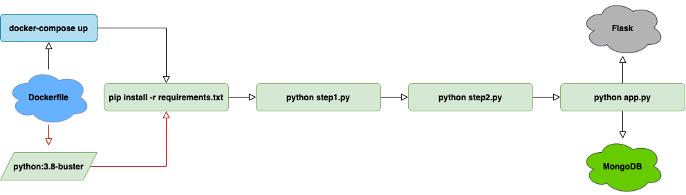

## Leco

***LECO*** is a THE web app for environnement and stuff 🌳 created by **ESIEE Paris** students, [Itokiana RAFIDINARIVO](https://www.linkedin.com/in/itokiana-rafidinarivo/) and [Romain FONTA](https://www.linkedin.com/in/fonta-romain-84130617a/).

This website is dedicated for those among you who want to improve, contribute toor/and understand this project in depth.

## Workflow

## Table of contents
- [Getting started with ***Leco***](pages/gettingstarted.md)
- [User Guide](pages/userguide.md)
- [Developper Guide](pages/developperguide.md)
