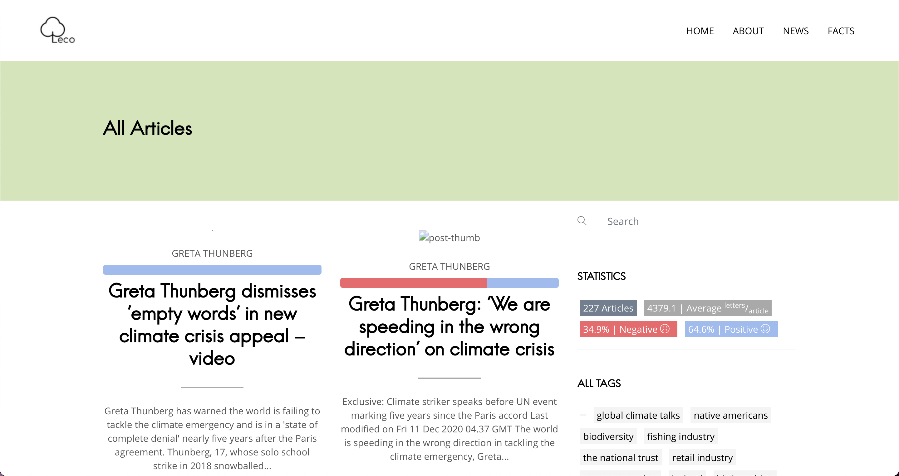
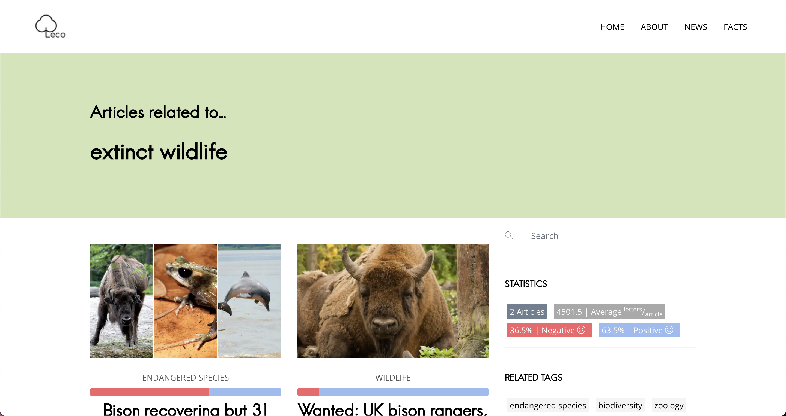

## User Guide

In this guide you will be shown the features of our web application and the meanings of the many elements on the pages.

### Home

On this page you can take a look at some articles and the different facts possible.

### News

#### All articles

On this page you can see:
- Articles
- Tags
- Some stats about articles

#### Articles by tag

This page can be accessed by pressing a tag item on a page, this will display every articles containing this tag.

#### Single article

This page is dedicated to an article, it contains : 
- a negative and positive percentage
- the author
- the date
- similar articles
- tags
- the body of the article

### Facts

The different page of this section are some data visualisation web pages.

#### Gas

On this page you can see the production of CO2, NO2 and SO2 on a map.

#### Protected Areas (Forest, Marine, Terrestrial...)

On this page you can see a table with the forest percentage area of a country and the evolution of
the protected areas (marine and terrestrial).

